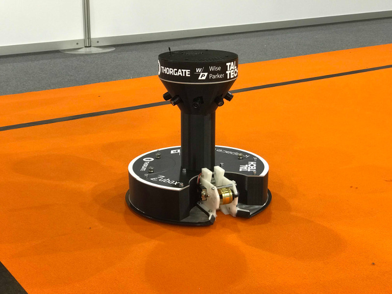

#Woop-woop-woop

This is the source code repository of software stack used by the robots Zoidberg and Nibbler on Robotex 2016 football 1vs1 competition. The Zoidberg ranked 4th place and additionally was awarded by [Proekspert](https://www.proekspert.ee/) with most elegant source code prize.


Besides two multithreading race condition bugs which were fixed mid-competition the robots performed well and lost to the top 3 robots mainly because of the speed. Most of the development was done with motor speeds capped at 40% of the maximum speed and bumping up the speed at the last minute would have broken down the gameplay logic.



##Teams

Team Lord with robot Nibbler:

* Mohanad Aly (captain)
* Fred‐Eric Kirsi
* Marek Juhanson
* Marju Niinemaa
* Kaarel Pärtel

Team Why Not with robot Zoidberg:

* Arti Zirk (captain)
* Joonas Jõeleht
* Madis Mägi
* Marvin Martinson
* Krista Norak

Lauri Võsandi was the instructor for both teams.

## Hardware

Hardware diagram:

```
                    8pcs PS3 eye cameras
                             |
10Ah 4cell LiFe -->   Gigabyte BRIX <--> Ciseco ERF
                             |
                             | (optocoupled UART)
                             |
10Ah 4cell LiFe -->  Arduino + custom shield --> Step-down --> Grabber motor
        |                     |
        |               Relay board -- Solenoid kicker
        |                     |
        \--------->    Nixie power supply
```

##Software

It's written in Python, it makes use of OpenCV bindings for Python and it's neatly pipelined. We use 8pcs PS3 eye cameras stacked together along the narrow edges, thus we get 3840x640 (4k!!!) resolution. Due to USB 2.0 bandwidth limits we are capped at 30fps for the maximum resolution. Image recognition thread latency is 16-17ms on Skylake i7 BRIX which drops to about 20ms if visualization web interface is opened. There is a web interface for debugging output, logs are sent using websocket to the browser and arbitrary gamepads can be used to control the robot using HTML5 gamepad API.

Pipeline is built with Python multithreading Queue objects and modified to be lossy. In total there is 20+ threads running, but because most of the heavyweight stuff runs in OpenCV and OpenCV bindings for Python correctly release Python GIL we have no bottlenecks.

* 8pcs separate Grabber threads because video grabbing code per camera is blocking. The code is custom crafted to get directly YUYV frames and properly handle camera disconnect/reconnect.
* PanoramaGrabber synchronizes grabber threads and produces stacked YUYV panorama frame and fills in the missing cameras if necessary.
* ImageRecognizer consumes YUYV panorama frame and produces information about recognized objects (goal coordinates, ball coordniates, closest edge, center of the field etc). If both goals are seen absolute coordinates of the balls and the robot is calculated although currently the gameplay does not make any use of that information.
* Gameplay consumes information about recognized objects and calculates what to do with motors and kicker.
* Arduino thread streams the last gameplay state to the microcontroller
* Visualizer thread is enabled when web interface is opened and it converts YUYV frames to RGB frames. Infromation overlay is added and frames are streamed to web browser using MJPEG encoding.

The pipeline components can be reused in different settings. For example a huge timesaver for us was running image recognition against video files recorded with on-board cameras:

* Player thread reads frames from video files and restores YUYV frames
* ImageRecognizer does whatever it usually does
* Visualizer thread applies information overlay
* Shower thread is used to display result in a window

In addition to the pipeline threads we also have:

* Observer thread which monitors /dev/serial and /dev/v4l to handle on-the-fly camera and serial dongle attachment
* RemoteRF thread which handles jugde's remote control signal over Ciseco RF dongle

We have ManagedThread class which can be used to build the pipeline and it also features profiling: framerate and latency can be measured, choking threads can easily be identified.

##Hardware assembly tips

Old school mechanically commuted DC motors emit a lot of noise. This noise is picked up by the USB cables and cause cameras to go nuts. Reproducible test for us was powering a DC motor from power supply near the camera (10cm) and playing with the throttle. Cameras would either disconnect or cause garbage frames to be produced. Adding ~100nF capacitors between DC motor connectors mitigates the issue and shielding the DC motor wires completely fixed the issue. In the end we used brushless motors though.

Electrostatic discharge is your enemy, use ferrite chokes on both ends of the USB cables. Reproducible test for us was running the robot along the carpet two rounds and then touching metal parts near the cameras with a metal ruler. The robot would discharge through the ruler (presumably) causing voltage spikes to be induced in the USB cables. This would cause cameras to disconnect. In some extreme cases whole USB controller would hang up losing all the USB ports on the machine. Adding two chokes per BRIX to USB hub cable and single choke per hub to camera cable fixed the issue.

PS3 eye cameras are very sensitive to environment noise in general. In extreme cases the PS3 eye firmware gets stuck in a glitchy mode producing consistently garbage frames and power cycling the camera is required. Nibbler ran 5 hours glitch free during the Robotex presumably because USB cables and hubs were taped with shielding tape right up to the camera itself.

Electromagnetic impulse emitted by the kicker solenoid causes voltage to be induced in the surrounding cables. Use ferrite chokes on the cables running nearby solenoid to microcontroller. Place choke on the microcontroller side of the cable. In our case the ball detection phototransistor and IR LED cables picked up the pulse from solenoid and caused Arduino to reset itself. The problem was fixed with chokes.

Ground loops are your enemy. The voltage drop along the ground lanes causes voltage difference to grow between components. In our case the ground loop was formed between battery, Arduino and BRIX. Whenever load was put on the system (image recognition) the Arduino would disconnect. We measured more than 250mV voltage difference between Arduino's ground and BRIX-s ground. The easiest solution was to electrically decouple the Arduino from BRIX. We moved USB-UART bridge near the BRIX and placed 6N137 high-speed optocouplers on Arduino's shield.


